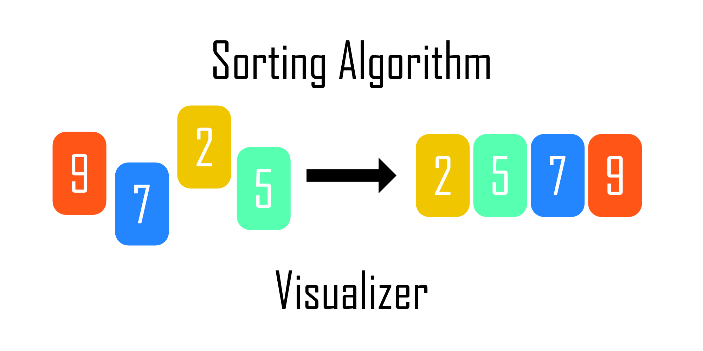
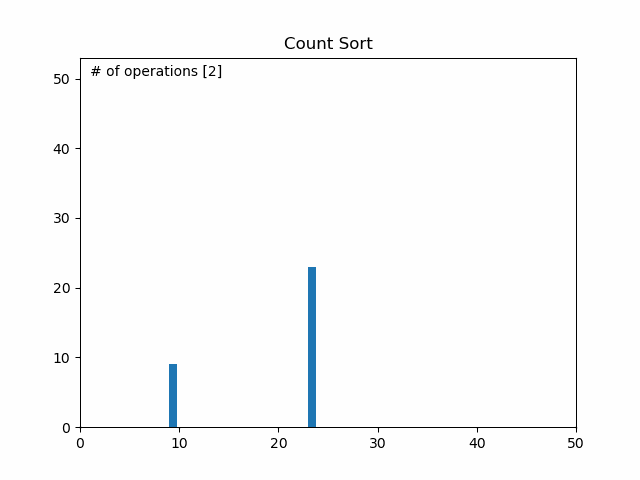
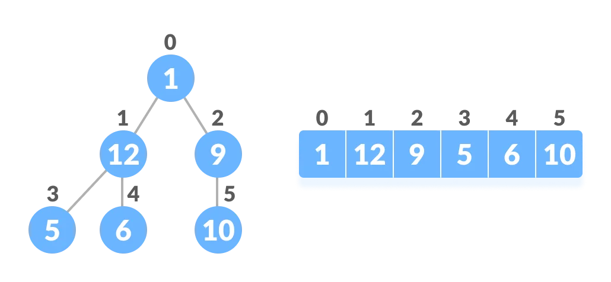
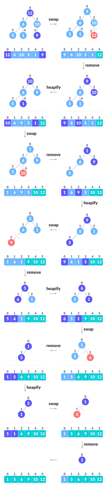
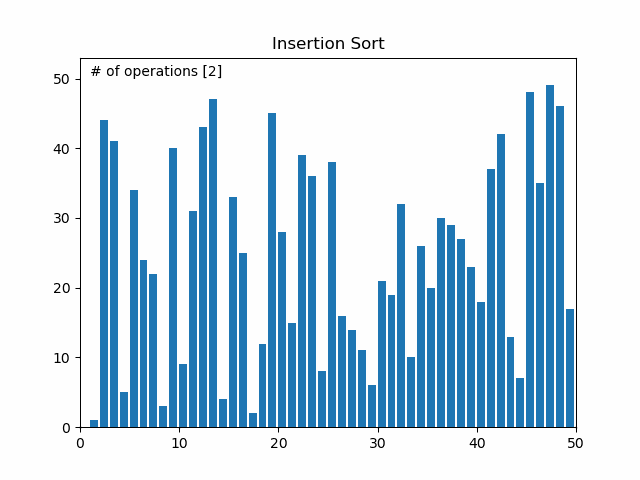
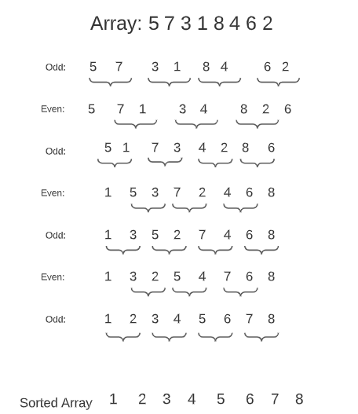
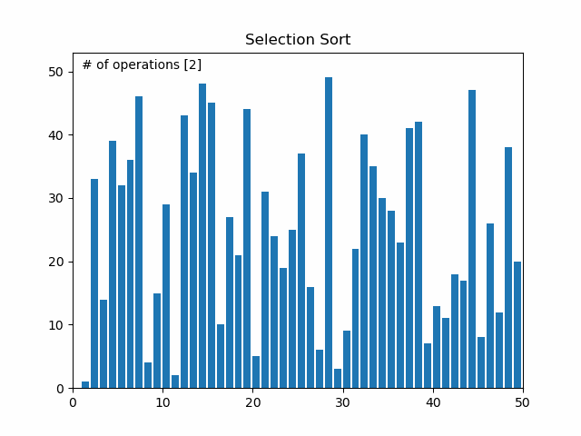

# About

Several scripts to visualize sorting algorithms using matplotlib animations.
The aim of this projects is to make sorting algorithms easier to understand, using the animation capabilities
of matplotlib.

The visualizer uses matplotlib.animate.FuncAnimation in order to visually update the diagram. However, this makes
the correlation between the time complexities of the sorting algorithms a bit random and misleading. For further
information please refer to the described time complexity for each algorithm. 

Since I am using the ```argparse``` module, you can randomly choose the ```interval``` argument to change the animation speed.

---

# Table of Content
- [Dependencies](#dependencies)
- [Command Line Arguments](#command-line-arguments)
- [Sorting Algorithms](#sorting-algorithms)
    - [Bubble Sort](#bubble-sort)
    - [Cocktail Shaker Sort](#cocktail-shaker-sort)
    - [Comb Sort](#comb-sort)
    - [Count Sort](#count-sort)
    - [Gnome Sort](#gnome-sort)
    - [Heap Sort](#heap-sort)
    - [Insertion Sort](#insertion-sort)
    - [Merge Sort](#merge-sort)
    - [Odd Even Sort](#odd-even-sort)
    - [Quick Sort](#quick-sort)
    - [Selection Sort](#selection-sort)
    - [Shell Sort](#shell-sort)

<be>

---
## Dependencies

- Python 3.3 or higher (because of ```yield```)
- Matplotlib (usually comes with ```Anaconda3```)
- JupyterLab if you want to use the notebook

<br>

---

## Command Line Arguments

```
usage: main.py [-h] [-l LENGTH] [-s SPEED] -a {bubble,cocktail,comb,count,gnome,heap,insertion,merge,odd_even,quick,selection,shell}

Visualizing sorting algorithms

optional arguments:
  -h, --help            show this help message and exit
  -l LENGTH, --length LENGTH
                        Count of numbers in the array
  -s SPEED, --speed SPEED
                        Set speed for animation
  -a {bubble,cocktail,comb,count,gnome,heap,insertion,merge,odd_even,quick,selection,shell}, --algorithm {bubble,cocktail,comb,count,gnome,heap,insertion,merge,odd_even,quick,selection,shell}
                        Sorting algorithm to animate
```

<br>

---

## Sorting Algorithms

Let´s get into the different sorting algorithms.
Before we start a quick introduction into time complexity. 

Time complexity is the computational complexity that describes the amount of computer time it takes to run an algorithm.
Time complexity is commonly estimated by counting the number of elementary operations performed by the algorithm,
supposing that each elementary operation takes a fixed amount of time to perform.
Time complexity is commonly expressed using big O notation, typically ``O(n), O(n log n``, etc, where n is the size in
units of bits needed to represent the input.

Best-case time complexity describes an algorithm´s behavior under optimal conditions. For example, the best base for a simple
linear search on a list occurs when the desired element is the first element of the list. In terms of sorting the optimal
condition is if the list is already sorted.

The worst-case time complexity indicates the longest running time performed by an algorithm given any input of size n,
and thus guarantees that the algorithm will finish in the indicated period of time. In case of the Bubble Sort the worst
case is if the list is sorted in descending order.

The spacy complexity of an algorithm is the amount of memory space required to solve an instance of the computational
problem. 

And finally, a sorting algorithm is said to be stable if two objects with equal keys appear in the same order in sorted
output as they appear in the input unsorted array. 

<br>

---

### Bubble Sort

Bubble sort is a sorting algorithm that compares two adjacent elements and swaps them until they are not in the 
intended order. Just like the movement of air bubbles in the water that rise up to the surface, each element of the 
array move to the end in each iteration. Therefore, it is called a bubble sort.

Suppose we are trying to sort the elements in ascending order. 

**First Iteration (Compare and Swap)**
1. Starting from the first index, compare the first and the second elements.
2. If the first element is greater than the second element, they are swapped.
3. Now, compare the second and the third elements. Swap them if they are not in order.
4. The above process goes on until the last element.

**Remaining Iteration**
The sampe process goes on for the remaining iterations. After each iteration, the largest element among the unsorted
elements is placed at the end. In each iteration, the comparison takes place up to the last unsorted element.

The array is sorted when all the unsorted elements are placed at their correct positions.

<br>

```python
def bubble_sort(a):
    """
    In-place Bubble Sort
    :param a: shuffled array
    :return: rearranged array
    """
    for i in range(len(a)):
        for j in range(0, len(a) - i - 1):
            if a[j] > a[j + 1]:
                tmp = a[j]
                a[j] = a[j + 1]
                a[j + 1] = tmp
            yield a
```

<br>

| **Time Complexity**  |            |
|----------------------|:------------:|
| Best                 | O(n)       |
| Worst                | O(n<sup>2) |
| Average              | O(n<sup>2) |
| **Space Complexity** | O(1)       |
| **Stability**        | Yes        |

<br>
<center>


</center>
<br>

---

### Cocktail Shaker Sort

Cocktail Sort is a variation of Bubble sort. The Bubble sort algorithm always traverses elements from left and moves the
largest element to its correct position in first iteration and second largest in second iteration and so on. 

Cocktail Sort traverses through a given array in both directions alternatively.

Each iteration of the algorithm is broken up into two stages:

**Move left to right**
1. Starting from the first index, compare the first and the second elements.
2. If the first element is greater than the second element, they are swapped.
3. Now, compare the second and the third elements. Swap them if they are not in order.
4. The above process goes on until the last element. At the end of the first iteration, the largest number will be at
the end of the array.
   
**Move right to left**
1. Starting from the ```len(a)-1``` element, compare it with the ```len(a)-2``` element
2. If the ```len(a)-2``` element is greater than ```len(a)-1``` swap them
3. Continue both stages until the array is sorted

<br>

```python
def cocktail_sort(A, start, end):
    swap = True
    while swap:
        for i in range(start, end):
            if A[i] > A[i + 1]:
                A[i], A[i + 1] = A[i + 1], A[i]
                swap = True
                yield A

        if swap == False:
            break

        swap = False

        for j in range(end-1, start-1, -1):
            if A[j] > A[j+1]:
                A[j], A[j+1] = A[j+1], A[j]
                swap = True
                yield A

        start += 1

```

<br>

| **Time Complexity**  |            |
|----------------------|:------------:|
| Best                 | O(n)       |
| Worst                | O(n<sup>2) |
| Average              | O(n<sup>2) |
| **Space Complexity** | O(1)       |
| **Stability**        | Yes        |

<br>
<center>


</center>
<br>

---

### Comb Sort

Comb sort is mainl an improvment over bubble sort. Bubble sort always compares adjacent values. So all inversions are
removed ony by one. Comb sort improves on bubble sort by using a gap size more than 1. The gap size starts with a large
value and shrinks b a factor of 1.3 in every iteration until it reaches the value 1. Thus comb sorts removes more than one
inversion count with one swap and performs better than bubble sort. 

<br>

```python
def calc_gap(gap):
    """
    Calculate new gap
    :param gap: previous gap
    :return: new gap
    """
    gap = (gap * 10) // 13
    if gap < 1:
        return 1
    return gap


def comb_sort(a):
    """
    In-place Comb Sort
    :param a: shuffled array
    :return: rearranged array
    """
    gap = len(a)
    is_swaped = False

    while gap != 1 or is_swaped:
        gap = calc_gap(gap)
        is_swaped = False
        for i in range(0, len(a) - gap):
            if a[i] > a[i + gap]:
                a[i], a[i + gap] = a[i + gap], a[i]
                is_swaped = True
                yield a

```

<br>

| **Time Complexity**  |                                |
|----------------------|:--------------------------------:|
| Best                 | O(n log n)                     |
| Worst                | O(n<sup>2</sup>)               |
| Average              | O(n<sup>2</sup>/2<sup>p</sup>) |
| **Space Complexity** | O(1)                           |
| **Stability**        | Yes                            |

<br>
<center>


</center>
<br>

---

### Count Sort

Counting sort is a sorting algorithm that sorts the elements of an array by counting the number of occurrences of each 
unique element in the array. The count is stored in an auxiliary array and the sorting is done by mapping the count as 
an index of the auxiliary array.

1. Find out the maximum element from the given array
2. Initialize an array of ```max + 1``` with all elements 0. This array is used for storing the count of the elements
   in the array.
3. Store the count of each element at their respective index in ```count``` array. For example if the count of element 3
is 2 then, 2 is stored in the 3th position of ```count``` array. If element 5 is not present in the array, then 0 is
   stored in the 5th position.
4. Store cumulative sum of the elements of the count array. It helps in placing the elements into the correct index of
   the sorted array.
5. Find the index of each element of the original array in the count array. This gives the cumulative count. Place the
   element at the index calculated.
6. After placing each element at its correct position, decrease its count by one.

<br>

```python
def count_sort(a):
    maxElement= max(a)
    countArrayLength = maxElement+1
    countArray = [0] * countArrayLength

    for el in a:
        countArray[el] += 1
    for i in range(1, countArrayLength):
        countArray[i] += countArray[i-1]

    outputArray = [0] * len(a)
    i = len(a) - 1
    
    while i >= 0:
        currentEl = a[i]
        countArray[currentEl] -= 1
        newPosition = countArray[currentEl]
        outputArray[newPosition] = currentEl
        i -= 1
        yield outputArray

```

<br>

| **Time Complexity**  |            |
|----------------------|:------------:|
| Best                 | O(n + k)   |
| Worst                | O(n + k)   |
| Average              | O(n + k)   |
| **Space Complexity** | O(n + k)   |
| **Stability**        | Yes        |
*Where k is the range of the non-negative key values*

<br>
<center>



</center>
<br>

---

### Gnome Sort

Gnome sort (nicknamed stupid sort) is a variation of the insertion sort that does not use nested loops. It is based on
the concept of a Garden Gnome sorting his flower pots. A garden gnome sorts the flower pots by the following method:

1. Starting from the first index in the array then go to the right element
2. If the current array element is larger or equal to the previous array element then go one step right
3. If the current array element is smaller than the previous array element then swap these two elements go and one step
   backwards
4. Repeat step 2 and 3 till reaching the end of the array
5. If the end of the array is reached then stop and the array is sorted

<br>

```python
def gnome_sort(a):
    """
    In-place Gnome Sort
    :param a: shuffled array
    :return: rearranged array
    """
    idx = 0
    while idx < len(a):
        if idx == 0:
            idx += 1
        if a[idx] >= a[idx-1]:
            idx += 1
        else:
            a[idx], a[idx-1] = a[idx-1], a[idx]
            idx -= 1
            yield a
```

<br>

| **Time Complexity**  |            |
|----------------------|:------------:|
| Best                 | O(n)       |
| Worst                | O(n<sup>2) |
| Average              | O(n<sup>2) |
| **Space Complexity** | O(1)       |
| **Stability**        | Yes        |

<br>
<center>


</center>
<br>

---

### Heap Sort

Heap sort requires the knowledge of two types of data structures - arrays and trees.

**Relationship between Array Indexes and Tree Elements**

A complete binary tree has an interesting property that we can use to find the children and parents of a node. 
If the index of any element in the array is ```i```, the element in the index ```2i + 1``` will become the left child
and element in ```2i + 2``` will become the right child. Also, the parent of any element at index ```i``` is given by
the lower bound of ```(i-1) / 2```.

<center>



</center>

Heap is a special tree-based data structure. A binary tree is said to follow a heap data structure if
- it is a complete binary tree
- All nodes in the tree follow the property that they are greater than their children, i.e. the largest element is at
  the root and both its children are smaller than the root and so on. Such a heap is called a max-heap. If instead, all
  nodes are smaller than their children, it is called a min-heap.
  
1. Since the tree satisfies Max-Heap property, then the largest item is stored at the root note.
2. **Swap:** Remove the root element and put it at the end of the array. Put the last item of the tree at the vacant place.
3. **Remove:** Reduce the size of the heap by 1
4. **Heapify:** Heapify the root element again so that we have the highest element at root
5. The process is repeated until all the items of the list are sorted.

<br>
<center>



</center>
<br>

```python
def heap(arr, n, i):
    root = i
    lc = 2 * i + 1
    rc = 2 * i + 2
    if lc < n and arr[i] < arr[lc]:
        root = lc
    if rc < n and arr[root] < arr[rc]:
        root = rc
    if root != i:
        arr[i], arr[root] = arr[root], arr[i]
        heap(arr, n, root)


def heap_sort(arr):
    n = len(arr)
    for i in range(n // 2, -1, -1):
        heap(arr, n, i)
        yield arr
    for i in range(n - 1, 0, -1):
        arr[i], arr[0] = arr[0], arr[i]
        yield arr
        heap(arr, i, 0)
        yield arr
```

<br>

| **Time Complexity**  |             |
|----------------------|:-------------:|
| Best                 | O(n log n)  |
| Worst                | O(n log n)  |
| Average              | O(n log n)  |
| **Space Complexity** | O(1)        |
| **Stability**        | Yes         |

<br>
<center>


</center>
<br>

---


### Insertion Sort


Insertion sort is a sorting algorithm that places an unsorted element at its suitable place in each iteration.

Insertion sort works similarly as we sort cards in our hand in a card game.

1. The first element in the array is assumed to be sorted. Take the second element and store it separately in ```key```
   Compare ```key``` with the first element. If the first element is greater than ```key```, then ```key``` is placed in 
   front of the first element.
2. Now, the first two elements are sorted. Take the third element and compare it with the element on the left of it.
   Placed it just behind the element samller than it. If there is no element samller than it, then place it at the
   beginning of the array.
3. Similarly, place every unsorted element at its correct position

<br>

```python
def insertion_sort(a):
    """
    In-place Intersection Sort
    :param a: shuffled array
    :return: rearranged array
    """
    for i in range(1, len(a)):
        key = a[i]
        j = i - 1

        while j >= 0 and key < a[j]:
            a[j + 1] = a[j]
            j = j - 1

        a[j + 1] = key
        yield a
```

<br>

| **Time Complexity**  |            |
|----------------------|:------------:|
| Best                 | O(n)       |
| Worst                | O(n<sup>2) |
| Average              | O(n<sup>2) |
| **Space Complexity** | O(1)       |
| **Stability**        | Yes        |

<br>
<center>



</center>
<br>

---

### Merge Sort


Merge sort is one of the most popular sorting algorithms that is based on the principle of Devide and Conquer Algorithm.

Here, a problem is devided into multiple sub-problems. Each sub-problem is solved individually. Finally, subproblems are
combined to form the final solution. 

<center>


</center>

**Divide and Conquer Strategy**

Using the Devide and Conquer technique, we divide a problem into subproblems. When the solution to each subproblem is
ready, we combine the results from the subproblmes to solve the main problem. Suppose we had to sort an array ```A```. A
subproblem whould be to sort a sub-section of this array starting at index ```p``` and ending at index ```r```, denote as 
```A[p..r]```.

*Divide:* If q is the half-way point between p and r, then we can split the subarray ```A[p..r]``` into two arrays 
```A[p..q]``` and ```A[q+1, r]```.

*Conquer:* In the conquer step, we try to sort both the subarrays ```A[p..q]``` and ```A[q+1, r]```. If we have not
reached the base case, we again divide both these subarrays and try to sort them.

*Combine:* Whe the conquer step reached the base step and we get two sorted subarrays ```A[p..q]``` and ```A[q+1, r]```
for array ```A[p..r]```, we combine the results by creating a sorted array ```A[p..r]``` for two sorted subarrays 
```A[p..r]``` and ```A[q+1, r]```.

<br>

```python
def merge_sort(a, start, end):
    """
    Function to recursively devide the array
    :param a: shuffled array
    :param start: startindex in array
    :param end: endindex in array
    :return: rearranged array
    """
    if end <= start:
        return

    mid = start + ((end - start + 1) // 2) - 1
    yield from merge_sort(a, start, mid)
    yield from merge_sort(a, mid + 1, end)
    yield from merge(a, start, mid, end)
    yield a


def merge(a, start, mid, end):
    """
    In-place Merge Sort
    :param a: shuffled array
    :param start: startindex in array
    :param mid: midindex in array
    :param end: endindex in array
    :return: rearranged array
    """
    merged = []
    left_idx = start
    right_idx = mid + 1

    while left_idx <= mid and right_idx <= end:
        if a[left_idx] < a[right_idx]:
            merged.append(a[left_idx])
            left_idx += 1
        else:
            merged.append(a[right_idx])
            right_idx += 1

    while left_idx <= mid:
        merged.append(a[left_idx])
        left_idx += 1

    while right_idx <= end:
        merged.append(a[right_idx])
        right_idx += 1

    for i, sorted_val in enumerate(merged):
        a[start + i] = sorted_val
        yield a
```

<br>

| **Time Complexity**  |            |
|----------------------|:------------:|
| Best                 | O(n log n) |
| Worst                | O(n log n) |
| Average              | O(n log n) |
| **Space Complexity** | O(n)       |
| **Stability**        | Yes        |

<br>
<center>


</center>
<br>

---

### Odd Even Sort

The odd even sort which is also known as brick sort algorithm performs bubble sort on the give array elements with two
different phases of odd and even. 

1. To sort an unsorted list, compare two adjacent integers and change them if the first number is bigger than the second
2. In the cas eof a descending order, the opposite is true
3. The odd-even transposition sort is divided into two phases: odd and even
4. Interchange numbers with their right-hand neighboruing number in both phases
5. Follow the steps until the array is sorted

<br>
<center>



</center>
<br>

````python
def odd_even_sort(a):
    """
    In-place Odd Even Sort
    :param a: shuffled array
    :return: rearranged array
    """
    is_sorted = 0
    while is_sorted == 0:
        is_sorted = 1
        for i in range(1, len(a) - 1, 2):
            if a[i] > a[i + 1]:
                a[i], a[i + 1] = a[i + 1], a[i]
                is_sorted = 0
                yield a

        for i in range(0, len(a) - 1, 2):
            if a[i] > a[i + 1]:
                a[i], a[i + 1] = a[i + 1], a[i]
                is_sorted = 0
                yield a

````

<br>

| **Time Complexity**  |                  |
|----------------------|:------------------:|
| Best                 | O(n)             |
| Worst                | O(n<sup>2</sup>) |
| Average              | O(n<sup>2</sup>) |
| **Space Complexity** | O(1)             |
| **Stability**        | Yes              |

<br>
<center>


</center>
<br>

---

### Quick Sort

Quicksort is a sorting algorithm based on the divide and conquer approach where

1. An array is divided into subarrays by selecting a pivot element (element selected from the array)
   While dividing the array, the pivot element should be positioned in such a way that elements less than pivot are kept
   on the left side and elements greater than pivot are on the right side of the pivot.
2. The left and right subarrays are also divided using the same approach. This process continues until each subarray
   contains a single element
3. At this point, elements are already sorted. Finally, elements are combined to form a sorted array.   

<br>

```python
def quick_sort(a, left, right):
    """
    In-place Quick Sort
    :param a: shuffled array
    :param left: leftmost element in array
    :param right: rightmost element in array
    :return: rearranged array
    """
    if left >= right:
        return
    x = a[left]
    j = left
    for i in range(left + 1, right + 1):
        if a[i] <= x:
            j += 1
            a[j], a[i] = a[i], a[j]
        yield a
    a[left], a[j] = a[j], a[left]
    yield a

    yield from quick_sort(a, left, j - 1)
    yield from quick_sort(a, j + 1, right)

```

<br>

| **Time Complexity**  |            |
|----------------------|:------------:|
| Best                 | O(n log n) |
| Worst                | O(n<sup>2) |
| Average              | O(n log n) |
| **Space Complexity** | O(log n)   |
| **Stability**        | No         |

<br>
<center>


</center>
<br>

---


### Selection Sort

Selection sort is a sorting algorithm that selects the smallest element from an unsorted list in each iteration and
places that element at the beginning of the unsorted list.

1. Set the first element as ```minimum```
2. Compare ```minimum``` with the second element. If the second element is smaller than ```minimum```, assign the second
   element as ```minimum```. 
   Compare ```minimum``` with the third element. Again, if the third element is samller, then aissgn ```minimum``` to the
   third element otherwise do nothing. The process goes until the last element. 
3. After each iteration, ```minimum``` is placed in the front of the unsorted list
4. For each iteration, indexing starts from the first unsorted element. Step 1 to 3 are repeated until all elements are
   placed at their correct positions.
   
<br>

```python
def selection_sort(a):
    """
    In-place Selection Sort
    :param a: shuffled array
    :return: rearranged array
    """
    for i in range(len(a)):
        min_idx = i
        for j in range(i + 1, len(a)):
            if a[j] < a[min_idx]:
                min_idx = j
        a[i], a[min_idx] = a[min_idx], a[i]

        yield a

```

<br>

| **Time Complexity**  |            |
|----------------------|:------------:|
| Best                 | O(n<sup>2) |
| Worst                | O(n<sup>2) |
| Average              | O(n<sup>2) |
| **Space Complexity** | O(1)       |
| **Stability**        | No         |

<br>
<center>



</center>
<br>

---

### Shell Sort

Shell sort is a generalized version of the insertion sort algorithm. It first sorts elements that are far apart from each
other and successively reduces the interval between the elements to be sorted.

We are using the shell´s original sequence ```N/2, N/4, ..., 1```

1. Suppose, we need to sort the array ```[9, 8, 3, 7, 5, 6, 4, 1]```
2. In the first loop, if the array size is ```N=8``` then, the elements lying at the interval of ```N/2 = 4```are
   compared and swapped if the are not in order
   - The 0th element is compared with the 4th element
   - If the 0th element is greater than the 4th one then, the 4th element is first stored in ```tmp``` variable and the
     0th element (i.e. greater element) is stored in the 4th position and the element stored in ```tmp``` is stored in
     the 0th position
   - This process goes on for all the remaining elements
3. In the second loop, an interval of ```N/4 = 8/4 = 2``` is taken and again the elements lying at these intervals are
    sorted
4. The same process goes on for remaining elements.
5. Finally, when the interval is ```N/8 = 8/8 = 1``` then the array elements lying at the interval of 1 are sorted. The
   array is now completely sorted.
   
<br>

````python
def shell_sort(a):
    """
    In-place Shell Sort
    :param a: shuffled array
    :return: rearranged array
    """
    split = len(a) // 2
    while split > 0:
        for i in range(split, len(a)):
            tmp = a[i]
            j = i
            while j >= split and a[j - split] > tmp:
                a[j] = a[j - split]
                yield a
                j -= split
            a[j] = tmp
            yield a
        split = split // 2
        yield a
````
<br>

| **Time Complexity**  |           |
|----------------------|:------------:|
| Best                 | O(n log n) |
| Worst                | O(n<sup>2) |
| Average              | O(n log n) |
| **Space Complexity** | O(1)       |
| **Stability**        | No         |

<br>
<center>


</center>
